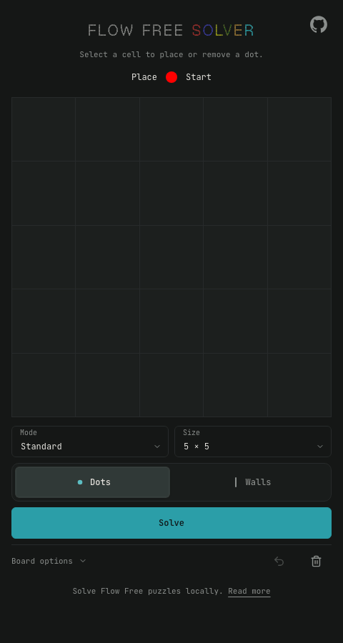
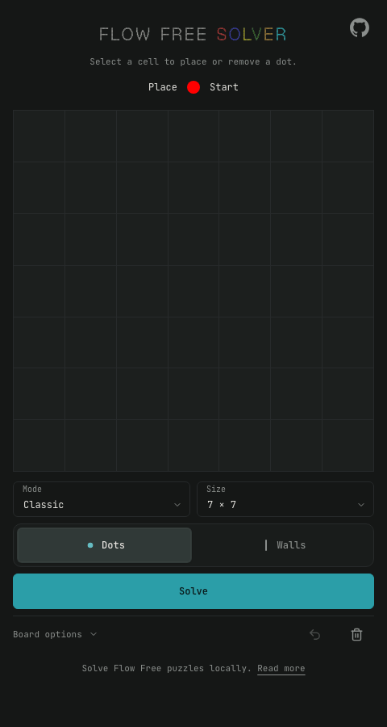
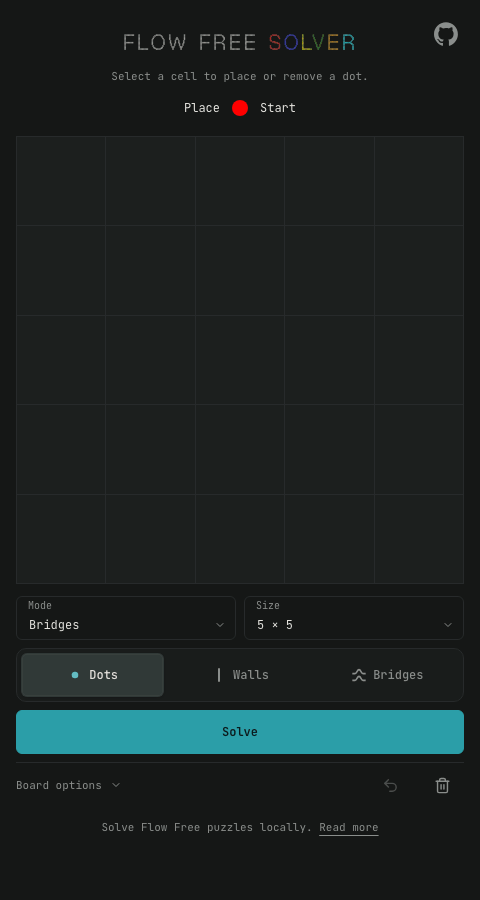
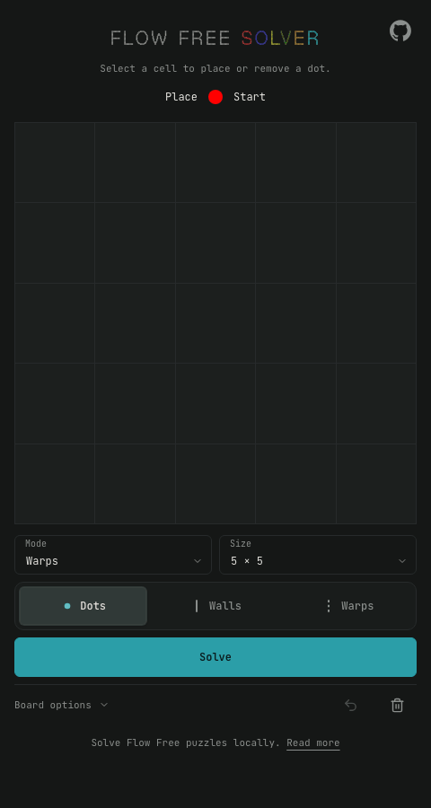

# Flow Free Solver

A free, open-source Flow Free and Numberlink solver that runs locally in your
browser. Supports Classic, walls, Bridges, Warps, and square or rectangular
boards with each dimension from 5 to 15.

**[Try the solver](https://flow.kongesque.com/)** · [How it works](https://www.kongesque.com/blog/flow-free-solver)

<p align="center">
  <a href="./assets/demos/classic.gif"></a>
  <a href="./assets/demos/walls.gif"></a>
</p>
<p align="center">
  <a href="./assets/demos/bridges.gif"></a>
  <a href="./assets/demos/warps.gif"></a>
</p>

## Solve a puzzle

1. Choose a **Mode** and **Size**. For a rectangle, set **Width** and **Height** in **Board options**.
2. Select **Dots** and place two endpoints of each color. Tap a dot to remove it.
3. Add any walls, bridges, or warp openings using the matching tool.
4. Select **Solve**, then **Edit** to return to the puzzle. **Cancel** stops a running solve; **Undo** reverses edits.

Or select **Generate** for a solvable Classic, Bridges, or Warps puzzle.
Generation is disabled while walls are present.

| Tool | Placement and rules |
| --- | --- |
| **Dots** | Connect every matching pair and fill the board. Ordinary paths cannot cross or share cells. |
| **Walls** | Tap or drag along internal grid lines to block movement between cells. Both neighboring cells still need to be filled. |
| **Bridges** | Tap an empty interior cell. Two different colors pass straight through the horizontal and vertical lanes; both lanes must be filled. The horizontal route goes over the vertical one. |
| **Warps** | Tap a row or column border to connect it to the opposite edge. Openings are optional routes, not required crossings. |

**Board options** includes color letters, coordinate guides, and a switch to
show or hide Generate. Color labels and board guides are off by default.
With guides enabled, hover highlights the current row and column; on a phone,
press, slide, and release to place a dot or bridge.

Keyboard: use arrow keys to move, Enter or Space to place, and Shift + Arrow to
edit a wall or an outward warp edge. Ctrl/⌘ + Z undoes the last edit.
Each mode saves its own puzzle locally on your device.

## Solvers and limits

Solving runs in background Web Workers. The app uses React, TypeScript, Vite,
and WebAssembly.

| Solver | Supported boards |
| --- | --- |
| **Heuristic BFS** (C/WebAssembly), adapted from [Matt Zucker's flow_solver](https://github.com/mzucker/flow_solver) | All implemented modes, walls, and rectangles; the recommended default. |
| **A\*** (TypeScript heuristic search) | Classic square boards without walls. |
| **SAT (Z3)** ([Z3](https://github.com/Z3Prover/z3) compiled to WebAssembly) | Classic square boards without walls. |

The solvers return one complete solution. Difficult puzzles can reach a search
limit; solve times depend on the puzzle and device. Hexes, Shapes, and combined
Bridges + Warps boards are not supported.

Generated puzzles retain a validated solution, which is used if a solve reaches
its search limit. Editing the puzzle discards that solution. Generation does not
check uniqueness or certify difficulty.

## Development

Use **Node.js 24 LTS** and npm:

```sh
npm ci
npm run dev
```

Compiled Wasm assets are checked in, so web development does not require
Emscripten. For native changes, use the version in `.emscripten-version`, run
`npm run build:wasm`, and commit both generated C artifacts. Never edit generated
Wasm glue by hand. Run `npm run check` before finishing implementation changes.

## License

[MIT](./LICENSE), with an exception for the heuristic solver adapted from
[Matt Zucker's flow_solver](https://github.com/mzucker/flow_solver). The following
files, including the native topology helper, are covered by
[CC BY-NC 2.0](https://creativecommons.org/licenses/by-nc/2.0/):

- `native/flow_solver.c` and `native/topology_solver.h`
- `public/wasm/flow_solver_c.mjs` and `public/wasm/flow_solver_c.wasm`
- `src/solver/logic/heuristic-solver.ts`

Commercial use requires excluding this module or obtaining a separate license
from its original author.

Built by [Kongesque](https://www.kongesque.com/).
