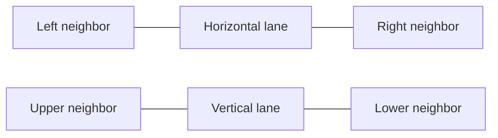

# Flow Free Warps and Bridges: research and implementation plan

Researched 2026-10-08 (Asia/Taipei). Source baseline: `c5177a0`.
Branch: `feat/warps-bridges`. This milestone changes documentation only.

## Recommended direction

Ship Warps first, then Bridges, using C/Wasm in the existing solver worker.
Keep Standard's current fast solver and saved puzzles working throughout.
Introduce explicit solution paths before enabling either mode: a color matrix
cannot encode two bridge lanes or reliably describe chosen warp connections.
Use a shared topology contract and a separate graph search path inside the C
module for variants, preserving the existing Standard entry points.

The first release should support square and rectangular boards from 5 to 15,
walls, selected opposite-edge warp openings, and editable bridge locations.
Generation stays available for Standard under its current restrictions. Variant
generation, Hexes, mixed Bridges + Warps, irregular shapes, and manual pipe
drawing are later work. The editor's job remains recreating a puzzle and
displaying its computed solution.

## Rules and evidence

The developer confirms matching pairs and complete coverage for both games,
with crossings permitted at bridges. Its pages are descriptions, rather than
exhaustive rulebooks: [official Warps page](https://www.bigduckgames.com/warps)
and [official Bridges page](https://www.bigduckgames.com/bridges).

### Warps

- An open left/right seam connects the first and last cell of that row.
- An open top/bottom seam connects the first and last cell of that column.
- Movement remains orthogonal. Wrapping creates an additional adjacency; it
  does not merge the two boundary cells or occupy a new cell outside the board.
- An available opening need not be used in the solution. Ordinary cells still
  carry a single pipe, and all matching pairs must connect with full coverage.

Visual evidence matters here. The developer's [5×5 Starter screenshot](https://images.squarespace-cdn.com/content/v1/586beec5e58c624be9f7b5a2/1502212905487-K600971JQS1I04S1UW2U/image-asset.png)
shows a red pipe leaving and re-entering at opposite edges of one row, with
the other border segments enclosed. Its [8×8 screenshot](https://images.squarespace-cdn.com/content/v1/586beec5e58c624be9f7b5a2/1502212983192-W1T2ENMUT8IXPO00ZPVB/image-asset.png)
shows repeated edge cells around the board. These observations support selected
seams as well as fully wrapped boards; neither screenshot establishes every
pack's layout conventions.

A [first-hand gameplay description with screenshots](https://codegolf.stackexchange.com/questions/223429/golf-your-finger-strokes-in-flow-free-warps)
describes opposite-edge wrapping and the surrounding shadow cells, including
corner shadows. It also reports internal walls. Use this as corroboration;
the proposed editor does not need to reproduce finger-stroke mechanics.

**Project rule:** expose individual opposite-edge seams plus enable-all
shortcuts. Do not model arbitrary interior teleporters, shifted rows, or
unrelated paired portals as Flow Free Warps without further evidence. Corner
shadows do not create diagonal graph edges. Walls only block internal edges;
outer seams have their own enabled/disabled state.

### Bridges

- A designated bridge contains independent left/right and up/down lanes.
- A pipe must continue straight through its lane; it cannot turn or change
  lanes at the crossing. The two pipes remain disconnected there.
- Require both lanes to be filled by different colors, alongside full coverage
  of ordinary cells. A path may not cross itself at a bridge.

The developer's [5×5 Bridges screenshot](https://images.squarespace-cdn.com/content/v1/586beec5e58c624be9f7b5a2/1483735906665-VOXZDY2LCQAMIWZI1M98/image-asset.png)
shows a horizontal red pipe arching over a vertical yellow pipe. The
[RPI Bridges specification](https://www.cs.rpi.edu/academics/courses/fall19/csci1200/hw/06_bridges_recursion/hw.pdf)
explicitly states straight traversal, two different paths per bridge in a
full-cover solution, and no self-crossing. This is a closely related teaching
variant that links the official app, not a developer-authored rulebook. Its
optional partial-coverage mode is outside this project's rules.

**Project rule:** bridges cannot contain endpoints, sit on the perimeter, or
touch a wall that closes one of their four required ports. Adjacent bridges
are allowed if each lane has its two ports. Store which axis is drawn on top
to reproduce a screenshot; that orientation changes appearance, not routing.
Treat these editor restrictions and different-color enforcement as an explicit
compatibility contract, and confirm them against playable official examples
before claiming compatibility with every pack.

### Common validity contract

Each color has exactly two original endpoints. A selected path has degree one
at its endpoints and two at every other occupied node. Paths must be connected,
contain no repeated nodes, and cover all required nodes without overlap. No
extra disconnected cycles are allowed. Available adjacency does not itself mean
two same-colored cells are connected: the selected path steps define that.

For project coverage calculations, a normal cell counts once and a bridge
counts twice. With `b` bridges, there are `width * height + b` required slots.
Warp shadows count zero additional slots. This is our validator denominator;
it is not a claim about the official app's displayed pipe percentage.

## Repository findings

| Current code | Consequence for variants |
| --- | --- |
| `game-modes.ts` exposes unavailable placeholders; `requireStandardMode` rejects them | Enable each variant only when its worker, validation, and editor work. Keep Hexes unavailable. |
| `FlowSolver.tsx` gates many actions with `isStandard` | Replace scattered checks with capabilities for editing, solving, generation, and supported algorithms. Merely setting `available: true` is insufficient. |
| `Board` and saved/solved/generated solutions are `number[][]` in `[x][y]` order | Keep the endpoint board; add a separate path solution type. Never squeeze two bridge colors into one number. |
| `PuzzleGrid.tsx` displays every solved color as a large dot | Add actual pipe rendering behind original endpoint dots. Bridge and warp continuity need visible segments. |
| Wall editing uses boundary hit testing, pointer capture, preview, stroke-level Undo, and keyboard shortcuts | Reuse its interaction principles for topology tools, while keeping one active tool. |
| `useStorage.ts` stores a single current draft; Undo snapshots contain endpoints and walls | Save variant topology, migrate legacy saves, and include topology in snapshots. |
| C positions are packed `uint8_t`, with a fixed 16-cell row stride; each cell has one color | Arbitrary bridge nodes cannot be added safely by extending the current cell enum. A graph engine needs separate IDs and lane occupancy. |
| C `game_can_move` and `game_make_move` calculate target coordinates directly | Changing only `offset_pos` would make wrap checks and actual movement disagree. |
| C `game_build_regions` unions only geometric left/up neighbors | Wrap-aware reachability must include seam edges; bridge lanes must remain separate components unless connected elsewhere. |
| C touch checks and automatic completion assume adjacency defines the path | Variant search must explicitly select connections and completion steps. |
| C bottleneck pruning is disabled for walls, but otherwise assumes a plane grid | Disable it for variants until its validity on the new topology is established. |
| `assert-solution.mjs` infers connections from neighboring colors | Add an independent path/lane validator; keep the legacy validator for Standard regression fixtures. |
| Generator starts from row/column covers and uses ordinary neighbors | Variant generation requires its own proof of a valid cover, rather than just a new neighbor list. |

The current C priority heuristic is remaining free cells; Manhattan distance
appears in color ordering. Do not mistake that ordering for the current search
cost. For future distance-based variant ordering, precompute shortest distances
on the actual static graph. Ordinary Manhattan distance can overestimate warp
distance. For a completely wrapped, wall-free rectangle the lower bound is
`min(dx, width-dx) + min(dy, height-dy)`; partial seams need graph distances.

## Proposed data and worker contracts

Add `src/solver/logic/topology.ts` and `solution.ts`. Keep all editor coordinates
zero-based and column-major; use row-major IDs only within the native adapter.

```ts
type Bridge = { x: number; y: number; over: 'horizontal' | 'vertical' };
type WarpSeam = { axis: 'horizontal' | 'vertical'; index: number };
// horizontal index is a row: (0,index) <-> (width-1,index)
// vertical index is a column: (index,0) <-> (index,height-1)

type PuzzleTopology = {
  walls: Wall[];
  bridges: Bridge[];
  warps: WarpSeam[];
};
type PathNode = {
  x: number;
  y: number;
  lane: 'cell' | 'horizontal' | 'vertical';
};
type PuzzleSolution = {
  version: 1;
  paths: { color: number; nodes: PathNode[] }[];
};
```

Normalize topology at load, in worker messages, and at the C boundary. Check
dimensions, coordinates, indices, modes, limits, endpoint conflicts, and
bridge ports. Deduplicate and sort records deterministically. Standard accepts
walls only, Warps accepts walls plus seams, and Bridges accepts walls plus
bridges. Reject incompatible nonempty fields; never ignore them. Missing fields
mean empty arrays. A variant board with zero special features is allowed and
uses that mode's pipeline; offer a quiet instruction to add a feature.

Model every ordinary cell as one graph node and every bridge as two nodes:



There is no edge between H and V. Remove internal edges blocked by walls; add
enabled warp edges in both directions. An edge into another bridge connects
to the corresponding axis. Each bridge lane has degree two by construction.

Use a uniform app response with `status: 'solved' | 'unsatisfiable' | 'limit' |
'invalid' | 'error'` and `solution: PuzzleSolution | null`. Adapt existing
Standard solver boards into paths only after independently checking their
open same-color graph. Update all consumers/tests together; A* timing and node
metrics can remain optional. Cancellation continues to terminate the worker.
An exhausted search budget must report `limit`, rather than assert no solution.

### Native boundary and search

Propose `solve_puzzle_topology_wasm(boardText, topologyText)` as a new export.
Keep the two existing exports and their result shape for current callers.
The adapter retains all `[x][y]`/row conversion and color mapping.

Use a small versioned text grammar instead of adding a JSON parsing dependency:
`V1`, `MODE,W` or `MODE,B`, internal walls `W,x,y,R|D`, bridge cells
`B,x,y,H|V`, and seams `S,H|V,index`, one record per line. Specify LF/CRLF,
optional final newline, record bounds, duplicate handling, and strict rejection
of unknown or truncated records in `native/README.md` before coding.

For native graph IDs, reserve `y * width + x` for each ordinary cell or
horizontal bridge lane. Allocate each vertical lane from `width * height`
upward, in canonical bridge order `(y,x)`. Use `uint16_t` IDs and counts, with
`UINT16_MAX` as the sentinel. A conservative capacity of 450 nodes covers
225 cells plus up to 225 extra lanes; editor restrictions reduce the actual
maximum. Never reuse packed coordinate helpers or 8-bit free/region counts
for these IDs. Check allocations and cap total search memory explicitly.

Return versioned JSON containing a status and ordered paths with native node
IDs and ASCII colors; decode to `PathNode` and app color IDs in the adapter.
This supplies selected steps without guessing from final colors. Use bounded
serialization, and reset all topology/search state on every call. The output
buffer ownership must remain documented, as with the current static buffer.

Implement the variant search as a separate graph-based C path in
`native/flow_solver.c`, with helpers factored into native files if useful.
Start with bounded backtracking, choosing the most constrained unfinished
path head, tracking ownership and selected predecessor edges. Enforce bridge
straightness through graph connectivity and unequal lane colors explicitly.
Use conservative graph reachability and degree checks, forced moves, and
remaining-slot accounting. Audit each pruning rule against a small independent
exhaustive oracle before enabling it. Avoid pre-enumerating all possible paths,
which can grow very quickly on wrapped graphs.

Retain a known solution from fixtures for testing, not as a solver fallback.
Benchmark easy and difficult square/rectangular cases through 15×15 before
advertising performance parity with Standard. Wider state increases memory
per search node; preserving the legacy engine avoids imposing that cost on
current users. Native changes still need both generated Wasm artifacts,
the pinned Emscripten compiler, and the Matt Zucker attribution/license exception.

## Editor and UI/UX specification

Keep the desktop panel beside the board and mobile panel below it. Make Mode,
Size, and editing tools directly accessible. Keep Solve/Cancel/Edit in one
position, with compact Undo and Reset actions beside Board options. Use Board options
for custom dimensions, applicable algorithm choices, and contextual bulk edits.
Show only implemented modes as usable choices; selecting a mode must lead to a
working editor. Omit Generate in variants and hide editing tools on solutions.

An example of the open options, not a new application screen:

```text
Mode [Bridges ▾]                   Size [5 × 5]
[ Solve                  ] [ Generate       ]
Edit: Dots   Walls   Bridges
Board options ▾                  [Undo][Reset]
  Width [5]                         Height [5]
  [Clear bridges]
```

Use one quiet text-tab selector with an active underline:
Standard has Dots/Walls, Bridges adds Bridges, and Warps adds Warps. Replace
the current Draw walls toggle as part of this change; do not add independent
toggles that can be active together. Keep every tool directly accessible,
including Dots, and reserve Board options for advanced settings and bulk edits.
The header, status, and help must reflect the current tool.

### Bridges workflow

1. Select Bridges and set dimensions. Start in Dots; place pairs as today.
2. Choose Bridges. Tap an empty valid
   interior cell to add it, or tap an existing bridge to remove it.
3. Keep the horizontal arch above the vertical lane. Do not expose orientation
   controls. Add/remove and Clear bridges are separate Undo entries.
4. Block conflicting placement with an explanation: “Remove this dot before
   adding a bridge” or “This bridge needs all four sides open.” Do not erase
   endpoints or walls automatically. Wall edits beside bridges use the same
   rule. Dots cannot be placed on bridges.
5. Solve shows continuous pipes. Draw the lower lane first, then an outlined
   raised segment for the upper lane. Use a gap/arch to communicate separation
   even when the colors have similar lightness. Original endpoints retain dots.

Initial bridge placement is tap-based. Bulk painting is optional later work;
it is less useful than the wall editor's continuous strokes and needs its own
error-recovery rules. Adopting horizontal presentation for older saved bridges
changes only appearance and preserves solution validity.

### Warps workflow

1. Select Warps. Start with no open seams and an instruction to add openings.
   No automatic change to a fully wrapped board.
2. Choose Warps. Tap a left/right border segment to toggle the seam for that
   row; either side controls the same record. Tap a top/bottom segment for a
   column. Preview and highlight both partners before applying the edit.
3. Offer “Open all left/right,” “Open all top/bottom,” and “Clear warps” in
   contextual controls. Each bulk action is one Undo entry. Ordinary taps are
   sufficient; drag painting may reuse the wall stroke add/remove discipline.
4. Show small paired border notches and neutral row/column labels (R3, C2),
   rather than portal colors that compete with endpoint colors. Closed border
   segments remain visibly closed. Explain: “Left and right connect in this row.”
5. In solution view, split a wrapped pipe into two border stubs. Clip it at
   the core boundary; never draw a long line across unrelated board cells.
   Highlight the partner on hover/focus/tap. An optional shadow rim can mirror
   opposite cells on open seams; those copies are presentation, not board data.

Reserve room for a narrow border gutter in all modes so introducing seam targets
does not shift the core board. Derive pointer coordinates from the core grid's
rectangle, not from a container including the gutter. Make bridge/wall overlays
noninteractive and seam targets a separate interaction layer. If a shadow rim
is offered, count it in fitted layout sizing. Keep the mobile core board at the
full available width.

### Touch, keyboard, and feedback

Keep the board fitted in every editing mode; Zoom and Pan were removed at the
user's request. Wall/warp active strokes capture the pointer; cancellation
discards the draft stroke. Keep keyboard editing available for dense boards.
WCAG's target-size criterion has a 24px minimum with
exceptions; a dense grid requires an actual assessment, not an automatic
conformance claim. [W3C target-size guidance](https://www.w3.org/WAI/WCAG22/Understanding/target-size-minimum.html).

Keep one core-board tab stop and roving arrow navigation. Enter/Space uses the
selected tool: dots or bridges edit the cell. In Warps, Shift+Arrow outward
from a boundary cell toggles that seam; internal directions do nothing and
cannot place a wall. In Walls, the existing Shift+Arrow shortcut remains.
Keep regular arrow navigation clamped at borders for predictability; it does
not wrap merely because the puzzle does. Add keyboard help and a rotate action
for a focused bridge. Replace `querySelectorAll('button')[index]` focus lookup
with explicit core-cell refs/selectors before adding seam or rotation buttons.

Label bridge cells with their coordinates, top axis, and both solution colors.
Label seams with both partners and open/closed state; expose bulk actions as
ordinary buttons. Do not put duplicate shadow cells into the Tab order. Add
descriptive accessible labels to endpoints and seams. Visible endpoints use plain
colored circles, without outlines or numbers, per the requested visual design.
[W3C use-of-color guidance](https://www.w3.org/WAI/WCAG22/Understanding/use-of-color.html).

Announce completed edits, Undo, and solver outcomes through a polite live region,
without announcing every pointer move or shifting focus. Use messages such as
“Bridge added, column 3, row 2” and “Row 3 warp opened, left to right.”
[W3C status-message guidance](https://www.w3.org/WAI/WCAG22/Understanding/status-messages.html).

Keep Generate beside Solve in all implemented modes and omit fixed algorithm
choices. Explain disabled Generate with “Clear walls to generate.” Native engine details do
not belong in the main task instructions. If search reaches its budget, say
“Search limit reached. Your puzzle is preserved.” Offer cancellation that
preserves the puzzle during long work; keep Reset's existing destructive-action
confirmation separate. Never invent search-progress percentages.

## State, persistence, and mode transitions

Use separate drafts for Standard, Warps, and Bridges, with the active mode saved.
This avoids silently interpreting one puzzle under another rule set. On first
entering a new mode, create an empty draft using the current dimensions; later
switches restore that mode's draft. Changes in one draft never alter another.

Save a versioned record, for example `schemaVersion: 2`, `activeMode`, and
`drafts`. Each draft includes dimensions, endpoints, topology, color-placement
phase, solver selection, and any valid generated solution. An IndexedDB store
upgrade is unnecessary if only the record shape changes. Migrate legacy
single-size and independent-dimension saves. Existing unavailable-mode saves
contain a Standard puzzle underneath the placeholder: preserve that as a
Standard draft and initialize the selected variant empty. Invalid topology or
unknown record versions need a visible recovery path; do not quietly drop data.

Keep Undo histories per draft in memory, capped at 50, and include endpoints,
walls, bridges, seams, and placement phase in each snapshot. Do not persist
history. Mode switching invalidates transient displayed results and safely
cancels any worker; histories and drafts survive the switch. Reset and resize
affect only the active draft and clear its history. Confirm populated-board
resizing consistently with Reset; cancellation preserves everything.

Endpoint and routing-topology edits invalidate solved and generated solutions.
Reset/resize also clear them. Edit preserves all topology. A bridge top-axis
change is visual only. Associate each computed/generated result with the exact
draft revision and mode; verify that association before display or fallback.
Add worker identity/revision guards so late messages cannot replace newer work.
Generate constructs and validates mode-specific topology and ordered paths in
the worker. Reject unavailable modes and generation against an existing wall layout.

## Delivery sequence and touchpoints

| Milestone / suggested focused commit | Work and completion gate |
| --- | --- |
| 1. `docs: plan warps and bridges` | This research, rules evidence, scoped decisions, and branch. |
| 2. `feat: add topology and path contracts` | New topology/solution types, capabilities in `game-modes.ts`, native wire specification, independent validators and fixtures. Variants remain unavailable. |
| 3. `feat: render explicit solution paths` | Adapt Standard worker results and generated solutions; update `FlowSolver`, `PuzzleGrid`, `StatusIndicator`, storage and tests. Pipes preserve legacy endpoints, walls, and Undo behavior. |
| 4. `feat: solve warp topology in wasm` | Add graph C path and export, wire `heuristic-solver.ts` and build script, compile both artifacts, prove seam/wall solving and limits through real Wasm tests. |
| 5. `feat: enable warp editor` | Seam UI, tools, draft migration and mode transitions, real worker E2E, mobile/keyboard checks; enable Warps only now. |
| 6. `feat: solve bridge lanes in wasm` | Split-node occupancy, unequal lane colors, validation of all ports, compiled regression corpus and memory benchmarks. |
| 7. `feat: enable bridge editor` | Add/remove/rotate, crossing render, Undo/persistence, keyboard and real worker E2E; enable Bridges only now. |
| 8. `docs: document variant workflows` | Final supported rules, controls, limitations, and recorded verification in README/native docs. |

Core paths: `src/solver/logic/{topology,solution,game-modes,heuristic-solver}.ts`,
`src/solver/workers/{solver,generator}.worker.ts`,
`src/solver/components/{FlowSolver,PuzzleGrid,SolverControls,StatusIndicator}.tsx`,
`src/hooks/useStorage.ts`, `src/app/index.css`, `native/flow_solver.c`,
`scripts/build-wasm.mjs`, and shared fixtures plus unit/Wasm/browser tests.
If native helpers become separate files, include them in compilation and its
build-source tests. Preserve `BASE_URL` asset loading and COOP/COEP headers.

## Regression fixtures and acceptance

Author synthetic cases with explicit expected paths and topology; do not copy
official packs into the repository. At least one fixture for each mechanic must
require using that mechanic, not merely include an unused feature.

| Area | Required cases |
| --- | --- |
| Warps | Required horizontal seam; required vertical seam; both axes; partial openings; fully wrapped board; unused available seam; wall detour; closed seam makes a known case unsatisfiable; tall/wide rectangles. |
| Bridges | One crossing with two different colors; both top orientations; adjacent bridges; multiple crossings; a wall elsewhere; incomplete lane, turning, endpoint on bridge, self-crossing, and perimeter bridge rejected. |
| Graph validity | All slots covered; correct endpoints; degree; connected paths; no detached cycle; no repeated node; no crossing lane transfer; no traversal through walls/closed seams; known colors only. |
| Native/API | Wrong versions, modes, records and indices; malformed result; repeated invalid/valid/Standard calls; upper bounds; search-limit status distinct from unsatisfiable; buffer and state cleanup. |
| App state | Mixed dot/wall/bridge/seam Undo; atomic bulk edits; reload; legacy migration; mode draft restoration; worker cancellation/stale result; Reset/resize confirm and cancel; Edit preserves topology; no stale generated fallback. |
| UI | Tap/pen/touch plus keyboard; precise border mapping; paired highlights; bridge separation; endpoint labels; plain dot rendering; preview cancellation; fitted boards; options collapse; stable board position; no horizontal page overflow. |
| Capabilities | Direct worker requests cannot run variants in A*/Z3 or generator; Standard behavior remains available; Hexes stays unavailable. |

The new fixture validator must reconstruct allowed graph edges independently
of solver helpers, then validate returned consecutive path steps, slot ownership,
degree, and connectivity. Include deliberately corrupted solutions to show the
validator catches a disconnected cycle, lane swap, and illegal warp. Compare
the C search to a small exhaustive oracle, including odd-dimension wrapped
graphs: they are not necessarily bipartite, so planar/parity shortcuts can fail.

Test synthetic larger bridges to exercise node/count values above 255; a
15×15 fixture with more than 30 bridges crosses that threshold. Benchmark the
new graph search separately from correctness. Record runtime/memory, timeouts,
and unsolved cases; a non-null response or visual appearance is insufficient.

After implementation, use Node 24 and the pinned Emscripten version:

```sh
npm run check
E2E_SERVER=dev npm run test:e2e
VITE_BASE_PATH=/flow-free-solver/ npm run build
VITE_BASE_PATH=/flow-free-solver/ npm run test:e2e
npm run build
```

Inspect desktop, 320px/390px portrait, short landscape, dense boards, enlarged
text, and keyboard focus. Exercise real workers and Wasm in production,
development, and subpath hosting. Commit both generated C artifacts with native
changes; never edit them manually. Run `npm audit` only if dependencies change.

## Later work and unresolved evidence

Before claiming exact official-pack support, verify bridge self-crossing,
both-lane coverage, perimeter/adjacent bridge layouts, and partial warp layouts
against playable official levels. The public pages and inspected screenshots
are sufficient to design this scoped release, but do not settle every edge case.
Mixed variants need a separate capability and UI decision; do not activate them
just because a generalized graph can represent them.

For later Warps generation, construct and retain a complete cover on the warp
graph, requiring at least one seam step when promising a warp puzzle. Bridges
generation must construct two valid occupied lanes at every bridge and preserve
straightness/different colors during mutations. Independently validate the
retained cover before returning endpoints. Uniqueness and difficulty are
separate features and should not be promised by construction alone.

This planning milestone used source review, public rule descriptions, official
screenshot inspection, and documentation diff checks. It does not claim a
working variant solver, measured variant performance, new UI usability results,
or completed application regression checks.

## Implementation record — 2026-10-08

The implementation enables Warps and Bridges on `feat/warps-bridges`.
The graph engine, versioned wire contract, fixtures, worker adapter, and generated
Wasm shipped together as a native milestone. The editor milestone adds separate
saved mode drafts, a session history per mode, selected-path rendering, tool
controls, cancellation, and legacy migration. No new dependencies were needed.

The native graph uses 16-bit IDs and an independent bounded DFS with necessary
degree/reachability/component checks. Its selected paths are validated before
the worker returns them. The fixture validator reconstructs edges independently;
an unpruned exhaustive oracle agrees on 80 seeded 3×3 wrapped boards. A 15×15
bridge fixture covers 394 nodes with 169 interior crossings, testing counts
above 255. A difficult existing 13×13 generated puzzle with one added seam
reaches the search budget and returns `limit`, then a fresh bridge call succeeds.

The release makes these concrete UI choices:

- Border targets sit inside the board, preserving its footprint as tools change.
  Opposite targets share state and highlight. Keyboard focus stays clamped;
  Shift + an outward arrow toggles a seam. The board stays fitted to the layout.
- Bridges toggle on empty interior cells. The horizontal route always passes
  above the vertical one; there is no orientation selector or rotation control.
  Older saved bridges retain their routes and adopt the horizontal presentation.
  Individual removals are reversible with Undo. There is no
  separate selected-bridge inspector or hover-placement preview in this release.
- Mode and Size stay visible; Dots/Walls and the active variant's tool are
  directly accessible during editing. Selection is explicit, so selecting the
  current tool does not silently return to Dots. Board options holds custom
  dimensions, applicable solver choices, and contextual bulk edits. Endpoint
  cells retain descriptive accessible labels; Color label optionally adds A–P to endpoints.
- The component picker sits above the shared Solve, Cancel, and Edit position.
  Puzzle generator is on by default; its switch shows or hides Generate beside Solve.
  Warp bulk-opening buttons sit above Color label and Puzzle generator in Board options.
  Separate Clear walls/bridges/warps buttons are omitted. Undo and Reset sit beside Board options and
  use labeled icons with 44px targets. Equal-width tool buttons share a single tray, pair labels with small glyphs
  matching the board marks, and use a softly filled selected state. Generate is available in all implemented modes; fixed
  C/Wasm solver choices and editing-only controls are omitted where inapplicable.
  Short landscape layouts preserve touch target size.
- Variant generation retains a validated ordered cover with its topology.
  Warps translate a Standard cover across borders, opening every used seam.
  Bridges seed independent crossing routes and transfer ordinary endpoint cells
  without turning inside a crossing or ending on a bridge lane. Both generators
  support every 5–15 width/height combination, deterministic seeds, and the 16
  color limit. Saves retain both lanes; editing invalidates the retained cover.
  Native search-limit fallback uses those paths rather than inferring lanes from
  a color matrix. Cancellation and failed generation preserve the active draft.
- Bridges use two continuous horizontal rails with arched centers and straight
  side stubs. Editing and solved crossings share the same shape. The upper pipe
  fills the raised deck between the rails, which masks the lower route at the
  crossing. Straight upper-lane SVG segments stop at the cell boundary so they
  do not draw through the arch.
- Walls and warp openings share the bridge rail color and weight. Warp openings
  use straight dashed lines along matching cell borders, with transparent editing
  targets and paired focus highlights. Closed seams have subtle solid border ticks.
- Solution rendering uses explicit SVG path steps, split warp stubs, and an
  outlined gap at crossings. Only the original endpoint cells retain dots.
- Saves use schema version 2 and keep flat active-draft fields for existing
  consumers. Invalid saved topology pauses editing/autosave until Reset. Legacy
  placeholder endpoint boards migrate to Standard, while their active variant
  starts empty. Variant drafts always select the C/Wasm algorithm.

Synthetic fixture timings below are median wall time of ten warmed calls under
Node 24.21.0 on this development Mac, including serialization and JSON parsing.
They establish a small reproducible baseline, not official-pack performance.

| Fixture | Recursive visits | Median time |
| --- | ---: | ---: |
| Warps 5×5, required row seams | 21 | 0.035 ms |
| Warps 15×15, required row seams | 211 | 0.254 ms |
| Bridges 5×5, one crossing | 17 | 0.014 ms |
| Bridges 15×15, 169 crossings | 391 | 0.775 ms |

The difficult 13×13 seam example returned `limit` after 2,000,001 visits in
approximately 2.8 seconds. The native state is fixed-capacity (450 nodes,
16 path arrays) and freed per call; the result buffer is 64 KiB. Peak runtime
memory has not been independently profiled. Search remains capped and does not
promise to solve arbitrary large variant boards. Generation stays Standard-only;
Hexes and mixed variants remain unavailable.

Browser coverage exercises real C/Wasm workers on square and rectangular
variants, independent full-cover validation, Edit/reload, mixed edits and bulk
Undo, draft switching, legacy migration, conflicts, resize/Reset cancellation,
Cancel/retry, and mobile touch on fitted boards. Existing Standard, A*, Z3,
generator, wall, persistence, and layout checks remain in the full suite.

Final verification used Node 24.21.0 and pinned Emscripten 4.0.23:

- `npm run check` passed native Wasm tests, unit tests, type checking, production
  build, and all 95 browser tests.
- `E2E_SERVER=dev npm run test:e2e` passed all 95 browser tests.
- The `/flow-free-solver/` production build and its full 95-test browser suite
  passed. The default root-hosted build was restored afterward.
- `git diff --check` passed. Dependencies were unchanged.
